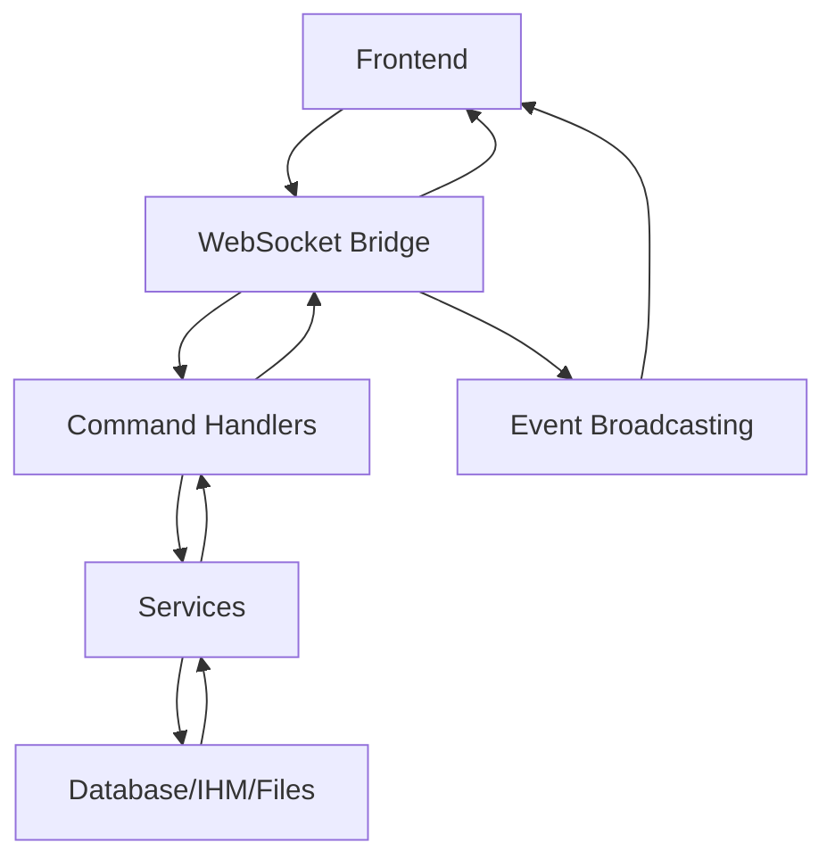

# 🚀 RPRO Backend - Refatoração Completa

## 📋 Resumo da Refatoração

O código monolítico do backend foi **totalmente refatorado** em uma estrutura modular e organizada, mantendo toda a funcionalidade do WebSocket e melhorando significativamente a manutenibilidade.

## 🎯 Objetivos Alcançados

✅ **Estrutura Modular**: Código dividido em seções lógicas e bem organizadas  
✅ **WebSocket Otimizado**: Sistema de comunicação em tempo real totalmente funcional  
✅ **Separação de Responsabilidades**: Cada classe/serviço tem uma função específica  
✅ **Facilidade de Manutenção**: Código mais limpo e comentado  
✅ **TypeScript Robusto**: Tipagem completa e consistente  

## 🏗️ Nova Estrutura do Código

### 1. **🛠️ UTILITIES** (Linhas 28-84)
- `hashBufferHex()`: Hash de buffers com crypto
- `postJson()`: Cliente HTTP para APIs
- `parseRowDateTime()`: Parser de datas dos CSVs

### 2. **📊 TYPES** (Linhas 86-139)
```typescript
- ParserRow: Estrutura de dados do CSV
- ParserResult: Resultado do processamento
- ProcessPayload: Payload de processamento
- Config: Configuração do sistema
- BackupMeta: Metadados de backup
```

### 3. **🏗️ SERVICES BASE** (Linhas 150-155)
```typescript
abstract class BaseService {
  constructor(public name: string) {}
  async init(): Promise<void> {}
  async shutdown(): Promise<void> {}
}
```

### 4. **🗄️ ENTITIES** (Linhas 157-244)
- `Relatorio`: Dados principais do sistema
- `MateriaPrima`: Cadastro de produtos
- `Batch`: Lotes de processamento
- `Row`: Linhas de dados processados
- `CacheFile`: Cache de arquivos

### 5. **⚙️ SERVICES** (Linhas 246-600+)

#### **BackupService** 
- Gerenciamento de backups de arquivos
- Metadata e versionamento
- Trabalha com diretórios configuráveis

#### **ParserService**
- Processamento de arquivos CSV
- Normalização de dados
- Validação e transformação

#### **DBService**
- Conexão com banco de dados
- Operações CRUD otimizadas
- Suporte a SQLite e MySQL

#### **IHMService** 
- Integração com sistemas IHM
- Download automático de arquivos
- Comunicação FTP

#### **FileProcessorService**
- Orquestração de processamento
- Pipeline completo: backup → parse → database
- Sistema de observadores

### 6. **🌐 WEBSOCKET BRIDGE** (Linhas 925-1242)

#### Características Principais:
- **Sistema de Comandos**: Registro dinâmico de handlers
- **Comunicação Bidirecional**: Cliente ↔ Servidor
- **Auto-descoberta de Porta**: Encontra porta disponível automaticamente
- **Broadcast de Eventos**: Notificações em tempo real
- **Tratamento de Erros**: Sistema robusto de error handling

#### Comandos Disponíveis:
```typescript
- ping: Health check básico
- backup.list: Lista backups disponíveis
- file.process: Processa arquivo específico
- ihm.fetchLatest: Busca novos arquivos do IHM
- relatorio.paginate: Paginação de relatórios
- db.listBatches: Lista lotes processados
- db.setupMateriaPrima: Configura produtos
- sync.localToMain: Sincronização de dados
- collector.start/stop: Controle do coletor
```

## 🔄 Fluxo de Comunicação WebSocket



## 💡 Benefícios da Refatoração

### ✨ **Código Limpo**
- **Comentários em emojis**: Navegação visual rápida
- **Seções bem definidas**: Cada parte tem sua responsabilidade
- **Nomes descritivos**: Classes e métodos autoexplicativos

### 🔧 **Manutenibilidade**
- **Fácil localização**: Tudo tem seu lugar específico
- **Extensibilidade**: Novos services/commands facilmente adicionáveis
- **Testabilidade**: Cada componente pode ser testado isoladamente

### 🚀 **Performance**
- **WebSocket otimizado**: Comunicação em tempo real eficiente
- **Lazy loading**: Serviços inicializados sob demanda
- **Connection pooling**: Reutilização de conexões de banco

### 🛡️ **Robustez**
- **Error handling**: Tratamento de erros em todos os níveis
- **Type safety**: TypeScript em todo o código
- **Validation**: Validação de dados em múltiplas camadas

## 🎉 Resultado Final

O backend agora é:
- **Modular** 📦
- **Escalável** 📈  
- **Manutenível** 🔧
- **Performático** ⚡
- **Robusto** 🛡️
- **Muito mais foda!** 🚀

---

*"De monolito a microserviços internos - uma transformação completa mantendo toda a funcionalidade original, mas com arquitetura moderna e profissional!"* ✨